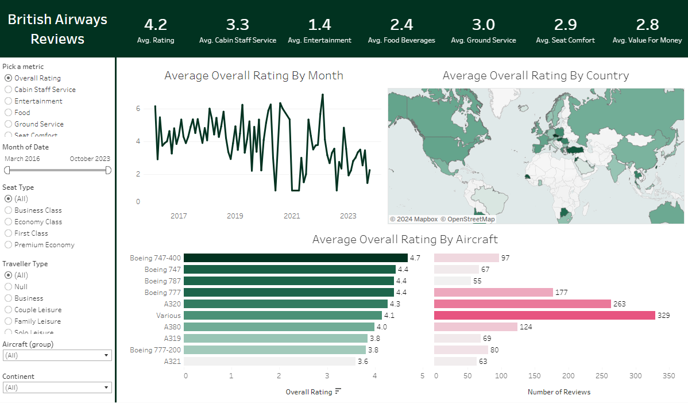

# British Airway Report

## Overview
The dashboard provides a summary of British Airways reviews, displaying the average ratings across multiple service categories, trends over time, geographical distribution of ratings, and aircraft-specific performance. The primary metrics are shown at the top with overall ratings and breakdowns across different service elements.

**Tool used**: Tableau

## Filter Panel 
1. Pick a metric: Users can select different aspects of service to evaluate, such as overall rating, cabin staff service, entertainment, food, ground service, and seat comfort.
2. Month of Date: A slider allows users to filter the reviews between March 2016 and October 2023.
3. Seat Type: Filters include various cabin classes (Business, Economy, First Class, Premium Economy).
4. Traveller Type: The dashboard allows filtering based on the type of traveler (Business, Family, Solo, etc.).
5. Aircraft (group): The user can filter by specific aircraft models.
6. Continent: Geographic filters are also available, allowing the analysis of reviews by continent.

## Charts:
1. A line graph showing the trend of the overall rating over time from 2016 to 2023. Ratings appear to fluctuate with noticeable peaks and troughs, particularly post-2020.
2. A map visual shows the distribution of average ratings by country. Darker shades likely indicate higher ratings, while lighter shades represent lower ratings.
3. A bar chart displays the average overall rating for different aircraft models, with color shading representing the rating (darker green = higher rating). It also includes a bar showing the number of reviews per aircraft model (indicated by the horizontal pink bars).

## Insights:

1. Overall Ratings: The average overall rating is 4.2, but certain service aspects like "Entertainment" (1.4) and "Food Beverages" (2.4) show significantly lower scores.
2. Ratings by Aircraft: The Boeing 747-400 has the highest rating (4.7), while the A321 has the lowest (3.6). The A320 has the highest number of reviews (329), which could indicate it’s a widely used aircraft for British Airways.
3. Geographical Distribution: There’s global coverage of ratings, though reviews from countries in Europe, the U.S., and parts of Asia seem more prevalent.
4. Temporal Trends: The ratings have generally fluctuated over time, with a notable drop around 2020-2021, possibly due to the pandemic's impact on service.
