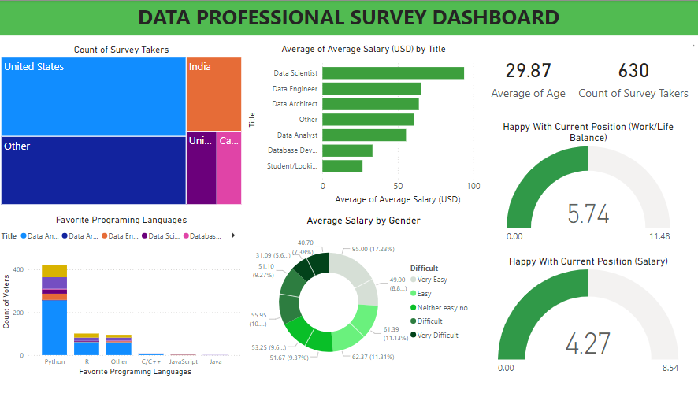

# Data Professional Survey Dashboard

## Overview
This dashboard presents insights from a data professional survey, with a focus on salary, job satisfaction, and programming language preferences.

**Tool used**: Power BI

## Charts
1. Count of Survey Takers: Largest from the US, followed by India and "Other" regions.
2. Average Salary by Title: Data Scientists and Engineers have the highest salaries.
3. Favorite Programming Languages: Python is the most popular, followed by R and SQL.
4. Average Salary by Gender: Slight variations among gender groups.
5. Average Age: The average age of survey respondents is 29.87 years.
6. Happiness with Work-Life Balance: Average rating is 5.74/11.
7. Happiness with Salary: Average rating is 4.27/8.54.

## Insights 
1. Data Scientists earn the highest average salary.
2. Python is the dominant programming language.
3. Survey respondents are moderately satisfied with both their work-life balance and salary.