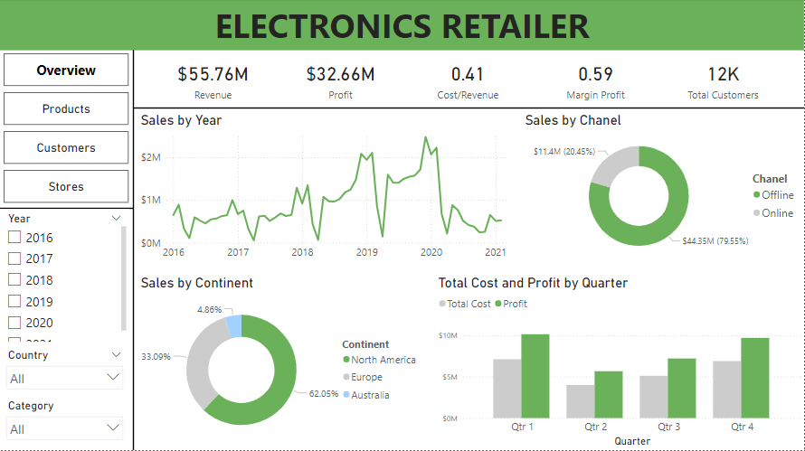
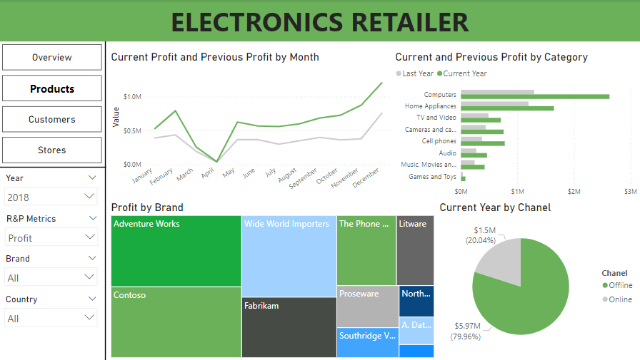
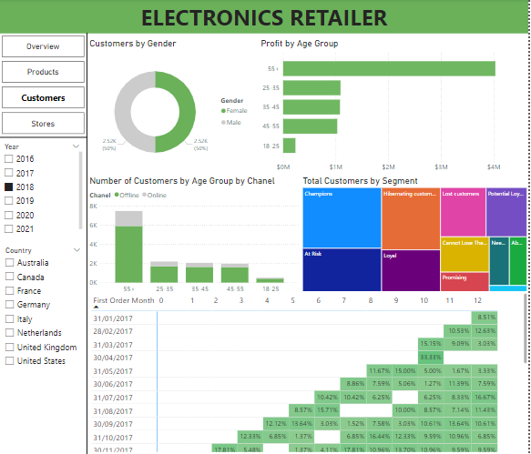
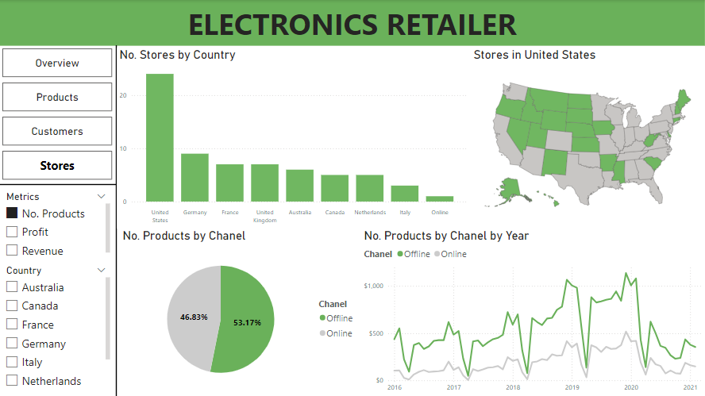

# Electronics Retailer

This project includes four dashboards: Overview, Products, Customers, and Stores. It highlights the retailer’s strong online sales, profit growth in computers, a customer base dominated by older age groups, and the importance of both physical stores and online channels.

**Tool used**: PowerBI

## Overveiew

### Key Insights

#### 1. Top Metrics
- Revenue: $55.76M, showing the total income generated by the retailer.
- Profit: $32.66M, indicating a strong profit margin.
- Cost/Revenue Ratio: 0.41, meaning for every dollar earned, 41 cents are spent.
- Margin Profit: 0.59, showing a healthy profit margin of 59%.
- Total Customers: 12K, representing the customer base size.
#### 2. Sales by Year (Line Chart)
- Sales data from 2016 to 2021 shows fluctuations in revenue.
- There is significant growth in 2019 and 2020, likely driven by external factors, possibly indicating strong sales seasons or market shifts. However, the trend declines somewhat toward 2021.
#### 3. Sales by Channel (Donut Chart)
- Offline: $11.4M (20.45%)
- Online: $44.35M (79.55%)
- This chart indicates that the vast majority of sales come from online channels, aligning with modern retail trends toward e-commerce.
#### 4. Sales by Continent (Pie Chart)
- North America dominates with 62.05% of sales.
- Europe accounts for 33.09%, while Australia contributes a small portion at 4.86%.
- This distribution shows the retailer's heavy focus on North American markets, with a secondary focus in Europe.
#### 5. Total Cost and Profit by Quarter (Bar Chart)
- This chart displays the cost and profit breakdown for each quarter:
- Q4 consistently shows the highest profit, suggesting strong sales during the holiday season.
- The gap between cost and profit widens in Q4, indicating a more efficient cost structure or higher margins during that period.

### Conclusion
This dashboard reveals the Electronics Retailer's strong reliance on online sales, with North America being the key market. The company has maintained a solid profit margin and shows seasonality in sales, particularly in Q4. This data could help inform decisions about expanding offline sales or further strengthening e-commerce operations.

## Products

### Key Insights

#### 1. Current Profit and Previous Profit by Month (Line Chart)
- The green line represents the current year's profit, while the gray line indicates the previous year's.
- Profits show an increase around May, with a sharp rise toward the end of the year, especially in November and December.
- This likely aligns with seasonal sales spikes, such as back-to-school and holiday shopping periods, showing a strong year-over-year improvement.ư
#### 2. Current and Previous Profit by Category (Bar Chart)
- The chart compares profits across different product categories for the current year (green) versus the previous year (gray).
- Computers generate the highest profit, significantly outpacing other categories.
- Home Appliances and TV and Video also contribute notable profits, while categories like Cameras, Cell phones, and - Games and Toys have lower but still substantial contributions.
Most categories have seen an increase in profit compared to the previous year, reflecting growth across multiple segments.

#### 3. Profit by Brand (Treemap)
- This visual shows the distribution of profits by brand.
- Adventure Works leads as the top-performing brand, followed by brands like Contoso, Wide World Importers, and The Phone Company.
- Each brand is represented by a color-coded rectangle, where the size reflects its relative contribution to overall profit.
- This allows for quick identification of the most profitable brands, with Adventure Works standing out as the largest contributor.

#### 4. Current Year by Channel (Donut Chart)
- Online sales dominate, accounting for 79.96% of total profit ($5.97M).
- Offline sales contribute a smaller portion, at 20.04% ($1.5M).
- This reflects a clear preference for online shopping, a trend consistent with other parts of the analysis.
Sidebar Filters
- The filters allow users to analyze data by Year, Profit, Brand, Country, and other metrics. For instance, the selected year is 2018, providing a snapshot of that specific year's performance.

### Conclusion
This dashboard highlights the retailer's strong performance, particularly in Computers, Online sales, and key brands like Adventure Works. The growth in profits compared to the previous year, especially in peak sales months like November and December, suggests the company is capitalizing on seasonal trends. The dominance of Online sales aligns with modern shopping behaviors, and the detailed brand breakdown offers valuable insights into the most profitable product lines.

### Key Insights

1. Profit trends from January to December show a sharp increase in the current year, especially from August onwards, indicating significant growth towards the end of the year compared to the previous year.
2. Computers lead in profit, followed by Home Appliances and TV and Video, while categories like Games and Toys contribute the least.
3. Adventure Works and Contoso are the top-performing brands, while others like Southridge Video and Proseware show lower contributions.
4. Similar to the previous dashboard, 79.96% of sales are offline ($5.97M), while 20.04% are online ($1.5M), reinforcing the dominance of physical store sales.

The retailer sees growing profits, particularly in the second half of the year, with Computers and Home Appliances driving sales. Offline channels remain the primary source of revenue.

## Customers

### Key Insights

1. Almost equal split between male (50%) and female (50%) customers.
2. 55+ age group generates the highest profit, followed by the 45-55 and 35-45 age groups, suggesting that older customers are contributing more to the retailer's profit.
3. Most customers are in the 55+ age group, with a strong preference for offline shopping. Younger groups (18-35) have significantly fewer customers, with slightly more activity online.
4. Champions and Loyal customers form the largest segments, highlighting a strong base of repeat buyers. Smaller segments include At Risk and Lost customers, which may require attention to retention strategies.

### Conclusion
The retailer's older customer base (55+) drives both profit and offline sales, while segmentation highlights a solid core of loyal customers. Retention efforts may need to target younger customers and those in at-risk categories.

## Stores

### Key Insights

#### 1. No. Stores by Country (Bar Chart)
- United States has the highest number of stores, significantly more than other countries, with around 25 stores.
- Germany, France, and United Kingdom have approximately 10 stores each, followed by Australia, Canada, and Netherlands.
- Italy and Online sales represent smaller categories, indicating fewer physical stores or the presence of online-only sales.
#### 2. Stores in the United States (Map)
- The map highlights various states, indicating the distribution of stores across the U.S.
- The green-shaded areas represent states with physical stores. Some states do not have any representation, which might indicate a potential opportunity for expansion.
#### 3. No. Products by Channel (Pie Chart)
- The product distribution is relatively even between Offline and Online sales channels:
    - Online: 53.17%
    - Offline: 46.83%
- This suggests that online sales slightly outpace offline, indicating a strong e-commerce presence.
#### 4. No. Products by Channel by Year (Line Chart)
- This chart tracks the number of products sold through Offline and Online channels from 2016 to 2021.
- There are notable fluctuations in both channels over the years, with a significant increase in 2019 and 2020, - - possibly due to global events impacting online shopping.
- The Online channel generally appears to perform better than the Offline channel, especially after 2019.
#### 5. Sidebar (Metrics & Country Filters)
- The sidebar includes options for selecting metrics such as No. Products, Profit, Revenue, and countries like Australia, Canada, France, etc.
- These filters suggest that users can drill down into specific metrics or regional data to get more granular insights into performance.

### Conclusion
Overall, this dashboard provides a comprehensive view of store distribution, product performance by sales channel, and the potential for growth in specific markets. The increasing trend in online products indicates a shift toward digital sales channels.