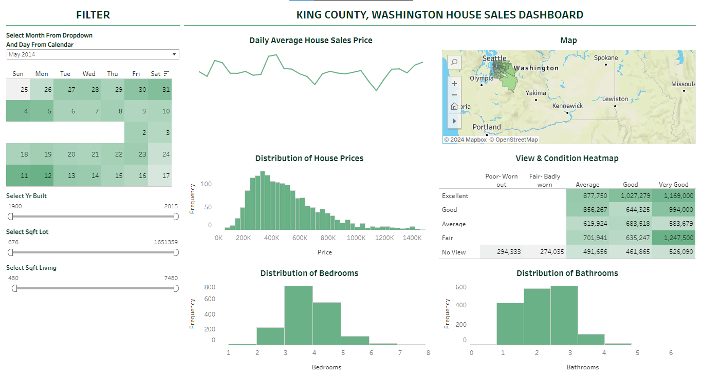

# House Sales Dashboard

## Overview
This project aims to create an interactive House Sales Dashboard to analyze and visualize real estate trends, helping users make informed decisions. Discover key insights in the housing market with ease!

**Tool used**: Tableau

## Filter Panel

1. Date Filter: You can select a specific month and day (May 2014 in this case). The calendar highlights available days for filtering the data.
2. Year Built, Sqft Lot, Sqft Living Filters: There are sliders to filter houses by the year they were built, the square footage of the lot, and the living area. This helps narrow down the dataset to specific property characteristics.

## Charts

1. Map: Geographic distribution of house sales in King County.
2. Distribution of House Prices: Bar chart showing the frequency of house sales across different price ranges.
3. View & Condition Heatmap: Heatmap displaying house prices based on condition and view quality.
4. Distribution of Bedrooms: Bar chart showing the common number of bedrooms in the houses.
5. Distribution of Bathrooms: Bar chart displaying the common number of bathrooms in the houses.

## Insights:
1. Most homes sold are in the mid-range price bracket ($200K to $600K).
2. Houses with good views and in excellent condition tend to have higher prices.
3. The typical home sold in this dataset has 3-4 bedrooms and 2-3 bathrooms.
4. The geographical distribution on the map can reveal regional trends in house prices within King County.